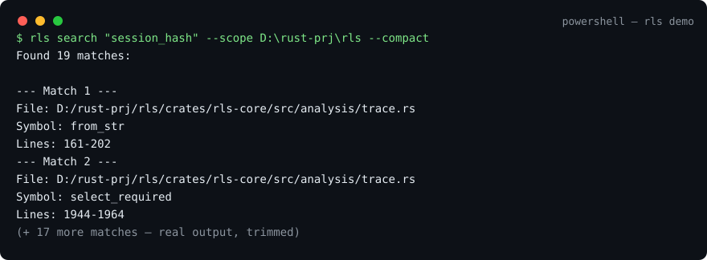

# RLS · Let AI read 90% less code, every hit verifiable

   

> AI reads projects via grep + full-file reads — most tokens wasted on redundant code. RLS retrieves structured slices locally, so only the necessary snippets reach the AI: **−91.3% total tokens on fixed sample tasks** ([how it was measured](docs/BENCHMARKS.md); reference magnitude, not a promise).

> **Binary-only distribution (no source)** · 中文版：[README.zh-CN.md](README.zh-CN.md) · Free trial · Windows x64 first
>
> RLS (Rust Local Search) runs locally, **built for AI agents first**: plug it into Claude Code / Codex once via MCP and the agent locates symbols and traces call paths itself instead of being fed whole files and directories. That self-serve lookup is where the −90% comes from. Humans get the same power in the terminal via CLI — same index, same result semantics.

## 🔒 Privacy: local only

- Runs 100% on your machine: code and index never leave it. The index lives on your own disk — nothing is uploaded, ever.
- Listens on `127.0.0.1` by default. No telemetry, no auto-update checks, no outbound requests.
- Single binary; the optional local service binds loopback too. Verify it all with a packet capture or firewall.

```powershell
# 60-second trial
.\rls.exe search "retry_with_backoff" --scope D:\your-project --compact
.\rls.exe outline D:\your-project\src --max-files 50
.\rls.exe context D:\your-project\src\retry.py 45
```

⭐ If it saves you tokens / file reads, please Star — for a closed-source project this is the public feedback channel.
🐟 Enterprise / on-prem / custom languages: see [CONTACT.md](CONTACT.md).

## Why RLS?

AI coding cost is rarely "can't find one line" — it is **Grep → Read × N, refilling context and guessing call graphs**.

RLS collapses it to:

```text
Locate symbol/file → inspect structure/definition → trace calls / impl / data-flow on demand
```

Return **file + symbol + line** first; let AI deep-read only what matters.

## Five tools

| Tool | Does | Note |
| --- | --- | --- |
| `search` | exact literal locate of defs/refs | `def/ref/all`, no regex |
| `outline` | file/directory structure map | map first |
| `context` | expand enclosing definition at `file+line` | source + callers/callees |
| `trace` | call path / implementation / data-flow / compare | evidence graph, `--compact` paging |
| `handover` | project handover fact prefetch | one command to hand over |

Details: [docs/FEATURES.md](docs/FEATURES.md), [docs/BEST-PRACTICES.md](docs/BEST-PRACTICES.md).

## Measured results (reproducible)

> Full AI trial walkthrough (in Chinese): [docs/TRIAL-REPORT.md](docs/TRIAL-REPORT.md) — 95-file mixed Rust/Python/TS repo, unknown symbol to def+callers in 3 calls ≈ 80 ms; honest limitations included.

Windows x64, 50 Rust files, 5 warmups, 30 samples (p95):

| Scenario | p95 |
| --- | ---: |
| Cold-start index | 53.61 ms |
| Warm query | 20.27 ms |
| Exact search | 3.74 ms |
| `trace` 4K bounded | 29.93 ms (~928 tokens) |

500 files: cold 324 ms / warm 27 ms. 5,000 files: cold 2.96 s / warm 91 ms.

Token estimate on fixed tasks: search+reads −84.5%, overview −85.9%, deep inspect −95.0%, total −91.3%. **Magnitude reference, not a promise.** Repro: [docs/BENCHMARKS.md](docs/BENCHMARKS.md).

## Quickstart



1. Get `rls-vX.Y.Z-windows-x64.zip` at [rls.swancat.com](https://rls.swancat.com) (free, login with your Swancat account), unzip to get single-file `rls.exe`. (Docs only in this repo, no binaries.)
2. Verify SHA256 published on the download page (also recorded in [CHANGELOG.md](CHANGELOG.md)).
3. CLI: `.\rls.exe --help`, `.\rls.exe doctor --json`.
4. MCP for AI (primary — this is what the agent calls): `.\rls.exe install`, `.\rls.exe service start`, endpoint `http://127.0.0.1:8765/`.

Structured languages: Rust, Python, JavaScript, TypeScript, Go, Java, C, C++. Others remain text-searchable.

## FAQ (short)

* **Open source?** No. Binary + docs only. See [LICENSE](LICENSE).
* **Does it upload my code?** No. Listens on `127.0.0.1` by default, index stays local.
* **macOS/Linux?** Core is cross-platform; Windows x64 ships first. Vote in [Issues](https://github.com/etherled/rls/issues).
* **Conflicts with my agent?** No, it is just an MCP tool + CLI.

More: [docs/FAQ.md](docs/FAQ.md), comparisons: [docs/COMPARISON.md](docs/COMPARISON.md).

---
*This repo contains no source code. Downloading means you accept [LICENSE](LICENSE).*
